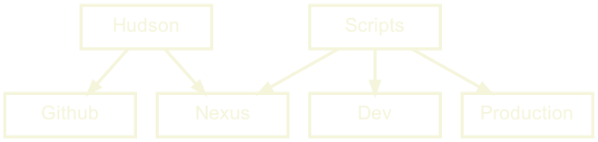
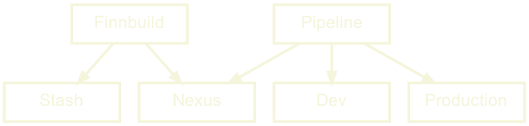
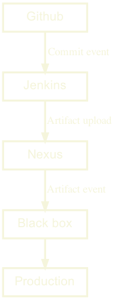
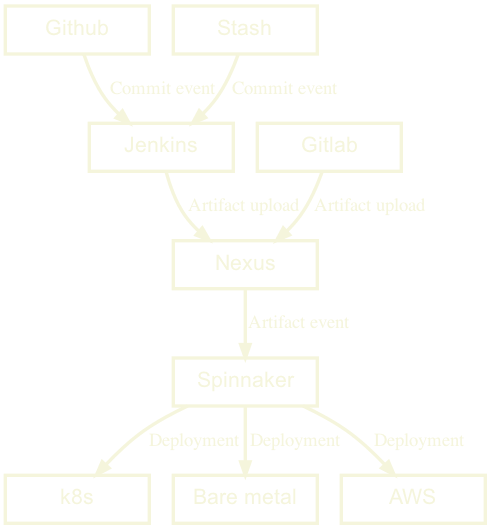

# {data-background-image="static/soria_moria.jpg" style="color:LightGray"}
## BUILDING A DELIVERY PLATFORM {.slide: style="color:Black"}
</br>
</br>
</br>

::: notes
- Hi, my name is Anders and I work with DevOps tooling at Piano here in Oslo
- I want to talk to you about delivery, and delivery automation today
:::

---

# {data-background-image="static/soria_moria_faded.jpg"}
## What I want to talk about
1. What is a Delivery Platform?
2. How do we build a Delivery Platform?

::: notes
- So we'll look at:
- What is a Delivery Platform?
- And how do we build one?
:::

---

# {data-background-image="static/containers_faded.jpg"}
## What is a Delivery Platform?

Let's start by looking at Delivery Automation

::: notes
- We'll start by looking at Delivery Automation in general
- By this I mean, automating the process of getting source code into production
- Let's look at some examples of delivery automation
:::

---

## Knowit's Delivery Automation

{.stretch}

::: notes
- So I worked at knowit as a consultant in 2011. Our project was building an integration bus for the municipality
- We had a pretty hip setup for the time, with a monorepo and a up to date Java version.
- So here we see, Hudson, the build server checks for commits in Github. If a change is found it
builds it and publishes the artifact to Nexus.
- We then invoked some Ruby scripts that fetched artifacts from Nexus and
deployed them to dev or production. This is the brain of the operation.
- In addition we had puppet for configuration, and Nagios for monitoring
- This worked great!
:::

---

## Finn's Delivery Automation

{.stretch}

::: notes
- In 2014 I joined Finn who had an ever more polished and customized Delivery System
- They had their own tool, Finnbuild which could run both locally and on
bamboo. It would let you build any Finn project just by issuing 'Finnbuild
build'.
- Like at Knowit, any change would get picked up, built, tested and uploaded to nexus.
- Then another homegrown tool, Pipeline would present a visual pipeline which
would allow you to deploy to test, and later production.
- This worked primarily for JVM projects, but as I left Finn support for
containers were also in the works.
- Finnbuild and Pipeline were the brains of this setup
:::

---

## Schibsted's Delivery Platform

{.stretch}

::: notes
- When I joined Schibsted in 2016 we set out to create a global Delivery Platform for about 1500 developers.
- Right of the bat there is a subtle difference here if we compare to Finn and
Knowit. This system doesn't have a central custom 'brain'.
Instead it's a sequential line of events. We'll get back to why that's important
later.
- But as we can see Github notifies Travis of new commits, who in turn builds, tests and uploads
the artifacts. Spinnaker is then notified about the new artifact and deploys them.
- Because of the diverse tech stacks, a custom brain just wouldn't be
feasible. It would be too complex.
:::

---

## What enabled these setups?

- Strong engineers
- Focus on best practices and continuous improvements
- Support from management

::: notes
- But all of these are pretty cool right?
- What enabled these companies to tailor their delivery process in this way?
- They had strong engineers with high nerd factor
- There was also a heavy focus on continuous improvements
- And Management understood the benefits of a good delivery process
:::

---

## What are these benefits?

- Automated Delivery
  - Productivity++
  - Trust++
- Short feedback loops
  - Productivity++
  - More engaged product teams

::: notes
- So what benefits did these setups bring?
- First of all automating delivery means less distractions, and more
productivity. And when you can trust this automation it gives security.
- Short feedback loops let's you fix problems when they are fresh in your mind,
which again increases productivity.
- All of this also allows product to come closer to developers as Proof of
Concept development is quick.
:::

---

## So did these companies have Delivery Platforms?

{.stretch}

::: notes
- Well, yes and no
- Knowit, Finn and Schibsted all had good tools that automated the Delivery
process
- The difference is is how these tools are connected
- To understand this, we need to look at what these tools are are doing
:::

---

## Let's look at what these tools are doing
  - Development loop
  - Deployment loop
  - Monitoring loop

::: notes
- We basically have three loops here
- Development, deployment and monitoring
:::

---

## Development loop

{.stretch}

::: notes
- The development loop starts by pushing some code change
- We build it
- We test it
- We Validate it using some static code analysis or security check
- If all is good, upload the built artifact
- If not, repeat the loop
:::

---

## Deployment loop

{.stretch}

::: notes
- So we started with the development loop
- Then we deploy the built artifact
- We run integration tests or manual tests
- Then we verify based on the results or a manual judgment
- And finally we deploy to production or go back to development
:::

---

## Monitoring loop

{.stretch}

::: notes
- We started with development loop
- Then we had the deployment loop
- Now we monitor and watch for problems
- This could be runtime errors, vulnerabilities and so forth..
- When a problem occurs, we alert and maybe we rollback
- In any case we go back to the development loop and start over
:::

---

## The Delivery Automation System

{.stretch}

::: notes
- So basically we have a loop of loops here
- This is what I call the Delivery Automation System
- Everything is chained together nicely
- All the steps are automated from src to prod
- Basically what Knowit & Finn had
- This is often implemented as a black box, that 'fixes CI/CD' as there is a custom brain
that knows how our tooling should be connected.
- For knowit this was some ruby scripts, for Finn it was Finnbuild and the
Pipeline tool. Both of these had custom 'brains' that controlled the workflow.
:::

---

## When a DAS is perfect

::: notes
- For Knowit a DAS was perfect. The code was mostly Java and kept in a
monorepo which was deployed to the same servers.
- This is where a DAS shines, and allowed for lot's of optimizations
- Finn had more diversity and their DAS was starting to get a lot of
additions. This meant that the tooling grew in complexity and they were basically
in a process of creating a Delivery Platform when I left.
:::

---

## When a Delivery Platform shines

::: notes
- For Schibsted, the DAS just couldn't work. As you might now, Schibsted is made up of several news sites and marketplaces
around the world. And thus there is a lot of diversity between these sites.
- We had different languages, build tools, artifact types, deployment targets
and for a Delivery Platform this works just great as we'll see.
- If you keep adding new tools and support new tech stacks and deployment
targets in a custom brain for delivery it will eventual become too complex and
impossible to maintain.
- If this sounds familiar a Delivery Platform might be a good next step for your
organization. So let's look at how that journey could be made.
:::

---

## From a DAS to Platform

{.stretch}

::: notes
- There are different ways this could be connected
- Maybe the DAS checks for new code, or may there is a webhook.
- But we need to make sure that there is a uniform interface here
- I've drawn the entire DAS inside the black box here, as there is usually only
custom integrations between the tools. Meaning we can't make any general
assumptions about how they are connected.
- If that's not the case for you, then you're already on your way!
:::

---

## From a DAS to Platform

{.stretch}

::: notes
- Let's say that we use Github for source code
- We define an integration rule that when source code wants to be built, our
black box must get a webhook.
:::

---

## From a DAS to Platform

{.stretch}

::: notes
- Again let's assume we have Jenkins for builds
- Jenkins should now own the webhook interface from source code
- And our next rule is that every build uploads a semantically versioned artifact
- Great, our black box is shrinking.
:::

---

## From a DAS to Platform

{.stretch}

::: notes
- Okay, so let's use Nexus for Artifacts
- And our next rule is that when a new artifact is uploaded, we send an event
to the black box to trigger deployment.
- Our black box now only deals with deployment
:::

---

## From a DAS to Platform

{.stretch}

::: notes
- finally, we add Spinnaker for deployments and our black box is gone
- Now we have a set of services, that are bound by clear rules
- In theory, this means that any part of our tooling can be replaced, as long as
the new tool abides by these rules.
- So let's onboard some teams from other parts of our organization.
:::

---

## From a DAS to chaos?

{.stretch}

::: notes
- Oh no, what happened to our nice graph? :(
- One team is using stash, which is fine as they hook into Jenkins.
- One team uses Gitlab, again fine as they upload to Nexus.
- One team is deploying to AWS, another to Bare Metal all fine as Spinnaker
supports these targets.
- And in our case of Spinnaker, we can even have a unified UI that visualizes
all of these different build pipelines.
- Instead of a complex black box, we have simple rules that allow for complex
graphs.
- Change is now a much much easier, because we removed the black box
:::

---

## The magic is in the glue, not the tools

::: notes
- A Delivery Platform doesn't care which build tool you use
- And neither should you.
- We want to be able to change quickly, not dig deeper holes.
- So we create glue by defining rules of interaction
:::

---

| Platform | DAS |
|-|-|
| Opt-in | Opt-out |
| Loose coupling | Tight coupling |
| Individual pipelines | Shared pipelines |
| Self served | Traditional SaaS |
| Dedicated Team | Collective effort |

::: notes
- Now this looks very clear cut, which is never the case with these things.
- But a platform is usually opt in, loosely coupled, customizable and self served
with dedicated support.
- Where as a Delivery Automation System is typically enabled by default, tightly
coupled with the tools and hard to customize.
- But at the bottom we see one of the main problems here
- The DAS is basically a SaaS, but it's usually not owned by one team, instead
it's often a collaborative effort which means it tends to acquire a lot of
technical debt.
:::


---

## A Delivery Platform is..

.. a __customizable__ set of __services__ that can be __composed__ through
__well defined rules__ into a
__pipeline__ that builds, verifies and deploys source code in a __secure__,
__predictable__ and __repeatable__ manner with __sane defaults__.

::: notes
- So to wrap up this part, I'll let you read the definition < let them read the slide >
- Or in keywords for those who hate walls of text, like me
:::

---

## Or to summarize
A test, build and deployment process which is:
- Customizable
- Secure
- Predicable
- Has sane defaults

::: notes
- Hopefully this has given us a common ground to build on.
- What I really want you to understand here is the difference between a Delivery
Platform and the more common Delivery Automation System and how they both are
good approaches but shine in different scenarios.
:::

---

# {data-background-image="static/soria_moria_faded.jpg"}
## Building a Delivery Platform
### The profit and pain

::: notes
- Right, so finally, how do we build one?
:::

---


# {data-background-image="static/map_help.jpg" style="color:black"}

::: notes
- Step one: figure out where we are!
- What is the current situation in our company?
- What works, what doesn't?
- What is currently causing the most pain?
- Where can we add the most value?
- Who can help us build this?
- Do we have backing to do this?
:::

---

# {data-background-image="static/map_help_faded.jpg"}
## Define our current state

::: notes
- Interview people from everywhere in the organization
- Developers, Infrastructure, Managers, Product, Maybe even customers?
- What are their thoughts on how we deliver software?
- Where do they feel that we are?
- Do they all agree? Usually, not.
:::

---

# {data-background-image="static/map_help_faded.jpg"}
## What are we looking for?

::: notes
- So what are we looking for here?
- We want to know What should we support by default
- Where we can give the most value
- We want to Identify what teams can collaborate, and share tooling or
customizations
- And we want to Identify and help mitigate political/personal issues between teams
:::

---


# {data-background-image="static/map_help_faded.jpg"}
## So am I a team friendship coach now?

Yes, kind of..

::: notes
- If the teams are not cooperating you will be blocked by discussions and
support.
- If teams are collaborating, they will support each other.
- Support and on boarding is by far the most expensive work in this process.
:::

---

# {data-background-image="static/map_help_faded.jpg"}
## Gather data

::: notes
- Step two
- Start gathering metrics to visualize what you've learned from the interviews
- Did the metrics confirm or deny what you learned?
- Let's put this data in a dashboard.
- One episode, where we added data from SonarQube. It showed a lot of tech
debt. SonarQube had been running for over a year, but now that it was
visualized one engineer took it upon them self to fix almost 200 hours of tech debt
in a couple of days. Instant win.
:::

---

# {data-background-image="static/map_help_faded.jpg"}
## Dashboards make it official

But be careful..

::: notes
- Dashboards make the metrics official, so show things that give value, but focus on what can be improved.
- Dashboards can help us argue the case for spending resources on tech debt or new features.
- But what management sees, they will measure us on. And metrics are almost
never the answer for measuring people performance.
:::

---

# The Golden Path {data-background-image="static/golden_path.jpg"}

::: notes
- Too much freedom, can be a bad thing if it means that you have to create your
entire deployment setup manually.
- So how much freedom is enough?
:::

---

# {data-background-image="static/golden_path_faded.jpg"}
## The open platform

We could just provide the tools and let everyone compose their own automations

::: notes
- We could have just provided a bunch of services for people to use.
- Freedom to choose from all the tools
- Could be nice for experienced DevOps teams
- Less dependent on the Platform team
- Huge cost in on-boarding for inexperienced teams though
- Basically what AWS does and it's not exactly a Delivery Platform
:::

---

# {data-background-image="static/golden_path_faded.jpg"}
## The Golden Path

Provide a default set of tools with batteries included

::: notes
- Instead we could provide a default set of tools with batteries included, and
this is in fact our third step.
- Teams are free to work on code, rather than configuration
- Teams are still free to customize their tooling
- They gain the security of having support
- On-boarding new engineers is much easier
:::

---

# {data-background-image="static/golden_path_faded.jpg"}
## The Golden Path; a shopping list

- A visual Pipeline
- Managed secrets & environment variables
- Hardened base images
- Monitoring with default metrics & logging
- Support

::: notes
- So what do we need for this?
- A visual Pipeline, like spinnaker or Gitlab or Tekton which can show us
    exactly what is currently happening in our delivery pipeline.
- Managed secrets & environment variables, automatically injected at runtime
- Hardened base images for containers or VMs
- Monitoring with default metrics & logging
- Support
- Let's look at a simple example at how we could onboard teams
:::

---

## example.yml

```yaml
  type: 'Java'
  application_name: 'dogfood-service'
```

::: notes
  - So let's opt in to the Platform by adding this example.yml file to our git
  repository.
  - It requires a type and a name for the app, that's it.
  - When we commit this file, a simple jenkins build is configured, along with
  deployment of the artifact and a container to k8s.
  - Everything we don't see here is set by default.
:::

---

# Is nice, yes? 👍

::: notes
- But how can we extend this?
- Maybe I want to disable the SonarQube check?
- Or change the health check url?
- I want freedom damn it!
:::

---

## example.yml

```yaml
  …
  healthchecks:
    liveness:
      http:
        path: /_/custom_health_path
  ingress:
    - host: dogfood-custom.ingress.local
  ports:
    - target_port: 6969
  replicas:
    maximum: 13
    minimum: 37
  SonarQube:
    - enabled: false
```

::: notes
  - Well this was actually a part of a k8s template
  - So we can drop straight into k8s. With full access to it's powers.
  - This example is based on PaaS, which we used at Schibsted.
  - And for a k8s shop, this makes a lot of sense.
  - You might need a different way of doing this in your platform.
  - But this idea can be implemented in many ways as it relies on a simple
  concept
:::

---

## Convention over configuration

  - Driving on an new road?
  - Eating in a new restaurant?
  - Talking to a new person?

::: notes
  - And the concept is convention over configuration.
  - What if you had to check a manual before: driving, eating or talking to
  someone?
  - Instead we rely on conventions
  - We know that driving on a road in Oslo is similar to most roads other roads.
  - This saves time, and makes us feel safe.
:::

---

## Convention over configuration

Not only user benefit from this

:::notes
- It makes a world of difference when:
- Integrating tools
- Figuring out what belongs where
- Setting up dashboards
- Naming conventions, between Github and Nexus for instance
- You can just follow the name
- If you know how we name things, you can find things without help.
:::

---

# {data-background-image="static/challenge_conventions.jpg"}


::: notes
- But don't just blindly follow
- Challenge the conventions when they seem wrong, that's how they evolve
:::

---

# {data-background-image="static/challenge_conventions_faded.jpg"}

Conventions should be like the golden path, not like a walled garden.

::: notes
- Conventions should be like the golden path, not like a walled garden.
:::

---

# {data-background-image="static/winner.jpg"}

::: notes
- So, how do we know that we are winning?
- How do we know our platform is useful?
- We have to define our success metrics
- interviews gave us status quo
- We know a bit about how to layout our platform and what our users need.
- But where do we want to go with this exactly?
:::

---

# {data-background-image="static/winner_faded.jpg"}
## Defining success (and failure)

- Desired state
- Incremental small goals
- Monitor for red flags

::: notes
- We should define a desired state, and this will be our step 4.
- We reach this state by creating small well defined goals, to keep us motivated
- Because a Delivery Platform is a constant work in progress
- There is no real end goal, but rather a moving target which is the 'desired state'
- This means that staying motivated can be hard, as we're always changing our goal. So savor the
small victories.
:::

---

# {data-background-image="static/winner_faded.jpg"}
## Monitor red flags

- Teams disabling features
- Lack of team metrics improvement

::: notes
- I also wrote monitor red flags on the previous slide. What could those be?
- Teams start disabling a certain feature, why? Is it not working/helping?
- Teams have no improvement on metrics, are they not using the tooling?
- Is this mutiny, rebells? Probably not.
- These are signs that the platform isn't helping them
- We need to understand why and adapt
:::

---

# {data-background-image="static/winner_faded.jpg"}
## Success isn't just about what developers want

::: notes
- The organization also needs us to focus on security, which is often overlooked
- People tend to think they have okay security, without any actual data or
proof, and then they get hacked and have no idea what to do.
- Like Mike Tyson says, "Everybody has a plan until they get punched in the
face"
- We can easily add security checks and alerts, and even automatically create pull request
for bumping dependencies. We could also supply tooling for incident management.
:::

---

# {data-background-image="static/lowhanging_fruit.jpg"}

::: notes
- So, we have our status quo, we have our 'desired state'
- How do we start actually doing this?
- First, we should use the tools ourselves.
- Then onboard smaller, newer teams with less legacy
- Usually they have less automation in place, maybe never even deployed to
production?
- They are often happy to get help, as they tend to be stretched for resources
:::

---

# {data-background-image="static/lowhanging_fruit_faded.jpg"}

> Here I am wearing myself out to get a bunch of sour grapes that are not worth gaping for.

\- Aesop's Fables

::: notes
- I'll let you read this quote from Aesop's Fables. <let them read>
- The story goes, that the fox eyed the biggest grapes hanging on the highest vine.
- When he couldn't reach them he belittled the grapes, as sour and not worth his time
- This is a classic mistake of over-reaching, and it's easy to do.
- As on-boarding high profile teams gives the platform publicity and validation
- But the stakes are high, and these teams don't have time to spend on your WIP
platform
- We need to be stable for these teams to onboard
:::

---

# {data-background-image="static/lowhanging_fruit_faded.jpg"}
## Ask for volunteers instead

Or prepare for a challenge!

::: notes
- So ask for volunteers, or prepare for a challenge!
- In the early phases of creating the first proper platform at Schibsted, we were
instructed to on-board certain teams
- This sometimes worked, but also failed as some of them didn't really need our tooling.
- We got stressed as we saw this would fail, and pushed harder which gave the impression
that we could give them orders.
- This also triggered a few cognitive biases, so let's just look at a few of those to be aware of.
:::

---

## Loss aversion

> We prefer avoiding losses to acquiring equivalent gains.

::: notes
- < let them read >
- We don't like loosing things, even with a potential gain.
- surprisingly, teams in dire need of migrating from unmaintained/buggy
solutions, were sometimes reluctant.
- They agreed that the situation was bad, but were never satisfied with our
offering even though they agreed it was better.
- They had invested a lot of time, in small nifty features.
- These things didn't seem important as they were minor things.
- But our brains don't work like that, we failed to pay attention, and they
did not want to lose their useful features.
:::

---

## IKEA effect

> We tend to place a disproportionately high value on products we've partially created.


::: notes
- < let them read >
- As a kid, I always felt that dinner tasted better when I helped make it.
- and keeping the previous team in mind, they had created this tooling themselves
- the IKEA effect probably contributed to their reluctance to on-board
:::

---

# {data-background-image="static/dogfooding.jpg"}

::: notes
- But not all biases will work against us.
- Let's say you're buying a new car. It's a bit expensive, but really nice.
- The sales person says: 'I drive this car my self.'
- Suddenly we trust their opinion more
- This is often labeled as a logical fallacy, but there is some truth to this
- Using the tools we make, is a great way to test, and improve them.
- Dog fooding makes us both early warning system, and experts
:::

---

# {data-background-image="static/dogfooding_faded.jpg"}
## Be aware though

You have insight into the tools in a way a user never will.

::: notes
- But be aware of your own advantage
- You know the code and the integrations
- You know where to report bugs and how to fix configuration
- And speaking of reporting bugs, how should we handle support?
:::

---

## Support

> We’ve started to on board teams and everything was going great! But suddenly
> they started asking questions, finding bugs and stealing all our time!


\- Some Platform Engineer probably

::: notes
- < let them read the quote >
- This isn't a direct quote, but it does illustrate a common problem
- How do users report problems?
- How do these reports find the responsible person/team?
- And who follows up on reports that span several teams?
- Is this the users responsibility, the teams, or someone else?
:::

---

## In the beginning it was great!
- One Delivery team of 4 people
- Artifactory, Travis and Spinnaker
- We helped people on Slack

::: notes
- In the early days at Schibsted we had one Delivery team of 4 people
- We provided Artifactory, Travis, Spinnaker in a nice platform package
- We helped people on Slack 24/7 and were extremely available
- This worked great, we got lots of valuable feedback
- Fast iterations, detailed bug reports, quick fixes
- The user felt safe, because we were right there with them
- It was Super fun!
:::

---

## But it doesn't scale

::: notes
- A few months later the magic was gone. We were exhausted.
- Repeated questions, outdated documentation, constant distractions.
- Some users were getting really frustrated, as their tickets weren't being handled
- We, were getting frustrated as we were getting nowhere
:::

---

## So what had changed?

::: notes
- 20 users had increased to 500
- We were no longer picking only low hanging fruits, but everyone was free to
onboard
- And this is all perfectly natural and needs to be addressed.
:::

---

# {data-background-image="static/white_knight.jpg"}

::: notes
- Suddenly; To our rescue, comes a white knight
- We had recently gotten a dedicated manager
- He helped us re-think our support setup
:::

---

# {data-background-image="static/white_knight_faded.jpg"}
## The Unified Support
- _One_ entrypoint
- Slack only for dedicated support, and incidents
- One call handles support routing

::: notes
- He introduced the unified support
- Letting users have one place to report bugs, for all services, all teams
- At this time there were other teams handling some services. But users only see
the front end. So that's where they report the bugs.
- Our previous Slack support channels became community channels instead.
- And in these channels user started taking on support, huge help!
- Finally we had support under control.
:::

---

# To summarize

1. Define your 'Current State'
  - Interview people
2. Get dashboards
3. Define a Golden Path
  - Rely on Convention over configuration
4. Define your 'Desired State'
  - Focus on low hanging fruits first
  - Observe and manage biases
5. Have a single point of entry for support

::: notes
- define your current state
- Create dashboards with metrics
- Define a golden path
- Define your Desired State
- Create a single point of entry for support
:::

---

# {data-background-image="static/full_speed.jpg"}

::: notes
- I'd like to end with this
- The pit stop was an analogy we used a lot at Schibsted
- We were the pit stop crew
- Developers were the drivers
- They knew where to stop
- We know who should fix what
- Quick fix, quick win
:::

---

# {data-background-image="static/full_speed_faded.jpg"}
## Questions?

Twitter/Github: @brujoand

PS: Piano.io is hiring in Oslo!

::: notes
- Feel free to share your experiences, ask questions or disagree with me on
- Shoot me a message if you want to learn more about working at Piano
:::
