# {data-background-image="static/soria_moria.jpg" style="color:LightGray"}
## BUILDING A DELIVERY PLATFORM {.slide: style="color:Black"}
</br>
by
</br>
Anders Brujordet

---

# {data-background-image="static/soria_moria_faded.jpg"}
## Topics
1. What is a Delivery Platform?
2. How do we build one?

---

# {data-background-image="static/containers_faded.jpg"}
## What is a Delivery Platform?


::: notes
- This is a bit complicated
- Let's start by looking at how I stumbled into building one
:::

---

## Getting my toes wet

- Company: Knowit Objectnet
- Developers: 50+
- Project: Public Sector Integration Bus

::: notes
- 10 years ago I was a Java consultant at Knowit, one of my first jobs
- 50 devs in company, 10 or so on my team.
- Working on integration bus for the municipality.
- CI: Hudson, Monitoring: Nagios, early adopters Github Enterprise
- CD: started slow, handholding, but then Puppet + some ruby
- A great first experience as a developer
:::

---

## What enabled this?

::: notes
- First off; I had no idea that this was weird in 2011, public sector
- Mostly geeks who loved their job
- A few key people drove this specific process
- __They had support from management__
- This just made sense to the company
- Even the financial chief implemented a coding challenge in excel during
a company trip.
:::

---

## Scal(a)ing up

- Company: Finn.no
- Developers: 150+
- Project: Public and Private REST APIs

::: notes
- After working 3 years on Java, I wanted to learn more Scala
- Finn had a really solid Scala team working on their APIs
- CI: Bamboo, CD: Puppet, Metrics: Grafana, Logging: ELK stack
- Lot's of tools, and homemade deployment web UI. Nice
- I got to create CI for Varnish
:::

---

## What enabled this?

::: notes
- Lot of the same culture as Knowit
- The organization was used to change
- Strong product organization that pushed for innovation
- Strong infra team and some eager Developers
- __They had support from management and product__
:::

---

## Entering the big leagues

- Company: Schibsted
- Developers: 1500+
- Project: Schibsteds Global CI/CD platform

::: notes
- Finally I joined Schibsted
- We created a global Delivery Platform
- CI: Travis, CD: Spinnaker, Metrics: DataDog, Logging: Sumologic
- We had a more active approach to tooling.
- On prem Travis, active partners on Spinnaker
- Many other teams were creating many useful tools
- Managed k8s clusters, custom secret management etc
- The approach was inspired by Netflix, Google, Twitter etc.
- Huge collaborative effort
:::

---

## What enabled this?

::: notes
- As you might now, Schibsted = Many similar marketplaces and news sites
- Naturally they have similar needs
- Daughter companies could save money by sharing the cost
- Strong infra organization, and development eager teams
- __They had support from top level leadership__
- Exceptionally hungry culture, very senior engineers
:::

---

## The common culture

- Strong engineers
- Focus on best practices and improvements
- Support from management

::: notes
- Strong engineers
- Focus on best practices and continuous improvements
- Support from management
:::

---

## The common benefits

- CI/CD is fully automated
- Shorter feedback loops
- Easier to visualize current status

::: notes
- Fully automated -> less distractions -> Happy developers -> Productivity
- Short feedback loops -> less bugs, faster fixes -> Productivity
- Insight -> Easier to argue for fixing tech debt
:::

---

## So were these Delivery Platforms?

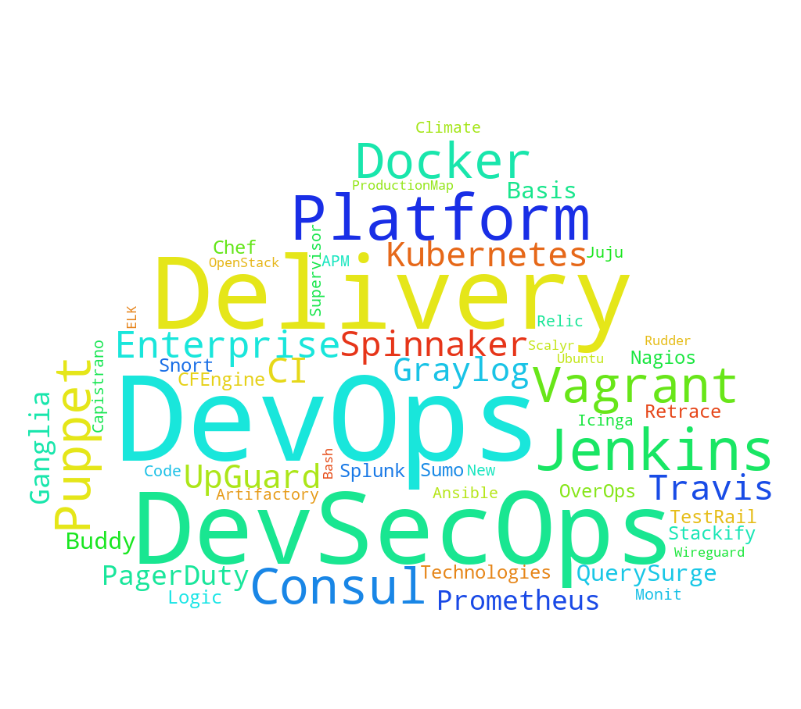{.stretch}

::: notes
- Yes and no
- Knowit, Finn and Schibsted had all the right tools
- The difference is is how these tools are connected
:::

---

## Let's break it down
  - Development loop
  - Deployment loop
  - Monitoring loop

::: notes
- We basically have three loops
:::

---

## Development loop

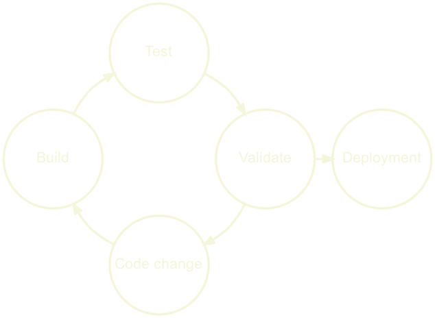{.stretch}

::: notes
- We push some code change
- We build it
- We test it
- Validate it, static code analysis, security audit
- If all good, upload
- If not, repeat the loop
:::

---

## Deployment loop

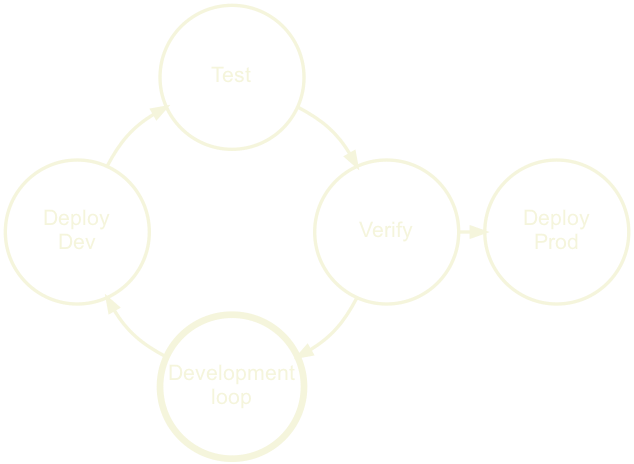{.stretch}

::: notes
- We start with the development loop
- We upload the built artifact
- Integration tests or manual tests
- Verify based on data or manual action
- Deploy to production
:::

---

## Monitoring loop

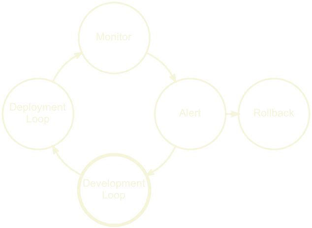{.stretch}

::: notes
- We started with development loop
- Then the deployment loop
- Now we monitor and watch for problems
- This could be runtime errors, vulnerabilities etc..
- Reported by metrics, logging, users or other tools
- When a problem occurs, we alert, maybe we rollback
- And we go back to the development loop
:::

---

## The Delivery Automation System

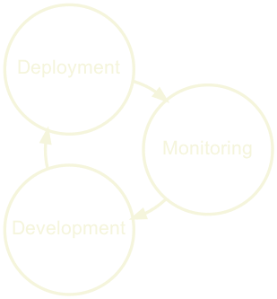{.stretch}

::: notes
- So basically we have a loop of loops
- This is what I call the Delivery Automation System
- Everything is chained together nicely
- All the steps are automated from src to prod
- Basically what Knowit & Finn had
- This can appear as a black box, that 'fixes CI/CD'
:::


---

## When a DAS is perfect

::: notes
- For Knowit a DAS was perfect
- Mostly Java, monorepo with all the cod, same deployment target
- Finn had a more diversity and their DAS was starting to get a lot of
additions.
- They were basically in a process of creating a Delivery Platform
- For Schibsted, the DAS just couldn't work. To much diversity.
:::

---

## When a DAS falls short

::: notes
- When the needs of the teams vary a lot
- Different languages, build tools, artifact types, deployment targets
- Backend, Machine Learning, search applications, frontend, mobile etc..
- Finn had started to feel some of this, and made additions to the DAS
- But every addition, makes the DAS more complex.
- Eventually they moved to a Delivery Platform
- So let's look at how that could be done

:::

---

## From a DAS to Platform

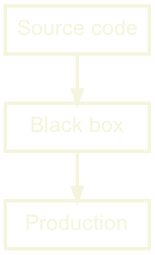{.stretch}

::: notes
- There are different ways this could be connected
- Maybe the DAS checks for new code, or may there is a webhook.
- But we need to make sure that there is a uniform interface here
:::

---

## From a DAS to Platform

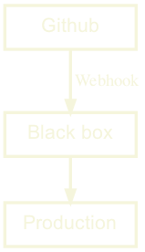{.stretch}

::: notes
- Let's say that we use Github for source code
- We define an integration rule that whet source code wants to be built, our
black box must get a webhook.

:::

---

## From a DAS to Platform

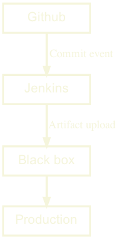{.stretch}

::: notes
- Again let's assume we have Jenkins for builds
- Jenkins should now own the webhook interface from source code
- And our next rule is that  build systems uploads a semantically versioned
artifact
:::

---

## From a DAS to Platform

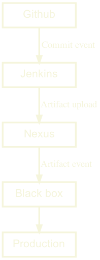{.stretch}

::: notes
- Okay, so let's use Nexus for Artifacts
- And our next rule is that when a new artifact is uploaded, we send an event
to trigger deployment.
- Our black box now only deals with deployment
:::

---

## From a DAS to Platform

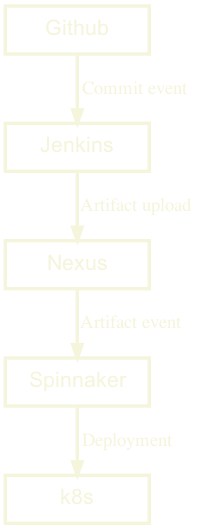{.stretch}

::: notes
- finally, we add Spinnaker for deployments
- and our black box is gone
- Now we only have a set of services, that are bound by very clear rules
- In theory, this means that any part of our tooling can be replaced, as long as
the new tool abides by these rules.
- So let's onboard some teams from other parts of our organization.
:::

---

## From a DAS to chaos?

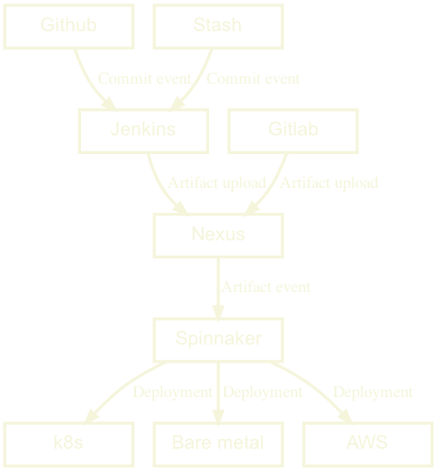{.stretch}

::: notes
- One team using stash, which is fine as they hook into Jenkins.
- One team uses Gitlab, again fine as they upload to Nexus.
- One team is deploying to AWS, another to Bare Metal all fine.
- And in our case of Spinnaker, we can even have a unified UI that visualizes
all of these different build pipelines.
- Instead of a complex black box, we have simple rules that allow for complex
graphs.
- Change is now a much much easier.
:::

---

## The magic is in the glue, not the tools

::: notes
- A Delivery Platform doesn't care which build tool you use
- And neither should you.
- We want to be able to extend upon these rules, not the specific tools
:::

---

| Platform | DAS |
|-|-|
| Opt-in | Opt-out |
| Loose coupling | Tight coupling |
| Individual pipelines | Shared pipelines |
| Self served | Traditional SaaS |
| Dedicated Team | Collective effort |

::: notes
- At the bottom we see one of the main problems here
- The DAS is basically a SaaS, but it's usually not owned by one team
- Usually it's a collaborative effort, which means it often gets neglected
- The platform could be used as a Delivery Automation System by relying only on
the Default Pipeline
:::

---

## A Delivery Platform is..

.. a __customizable__ set of __services__ that can be __composed__ through
__well defined rules__ into a
__pipeline__ that builds, verifies and deploys source code in a __secure__,
__predictable__ and __repeatable__ manner with __sane defaults__.

::: notes
- That's probably the longest introduction I've had to any presentation
- But this talk doesn't make sense if we don't have the same definition of what
a Delivery Platform is.
- And especially how it relates to the more common Delivery Automation System.
:::

---

# {data-background-image="static/soria_moria_faded.jpg"}
## Building a Delivery Platform
### The profit and pain

::: notes
- So finally, how do we build one?
:::

---


# {data-background-image="static/map_help.jpg" style="color:black"}

::: notes
- First we need to figure out, where we are
- What is the current situation in our company?
- What works, what doesn't?
- What is currently causing the most pain?
- Where can we add the most value?
- Who can help us with this?
- Do we have backing to do this?
:::

---

# {data-background-image="static/map_help_faded.jpg"}
## If lost, ask for help

::: notes
- Talk to a few people from everywhere
- Developers, Infrastructure, Managers, Product, Maybe even customers?
- What are their concerns, pain points with regards to delivery?
- Where do they feel that we are?
- Do they all agree? Usually, not.
:::

---

# {data-background-image="static/map_help_faded.jpg"}
## Interviews will give you vital information

::: notes
- Which components we need
- Where are we loosing the most time and resources
- What would give the most benefit?
- Identify was teams can collaborate, and share tooling
- Identify and help mitigate political/personal issues between teams
:::

---


# {data-background-image="static/map_help_faded.jpg"}
## So am I a team coach now?

Yes, kind of..

::: notes
- If the teams are not cooperating you will be blocked by discussions and
support.
- If teams are collaborating, they will support each other.
- Support and on boarding is by far the most expensive work
- The problems are usually very similar, and simple to fix
- The overhead of constantly context switching is huge
- Most people just glance at documentation, and then ask for help.
- Make sure they have friendly teams they can talk to.
:::

---

# {data-background-image="static/map_help_faded.jpg"}
## Get the data

::: notes
- Start gathering metrics to visualize what you've learned from the interviews
- Did the metrics confirm or deny what you learned?
- You might find ticking bombs, that we have to fix ASAP.
- Or things that work really well. We need to keep those.
- Let's put this data in a dashboard.
:::

---

# {data-background-image="static/map_help_faded.jpg"}
## Dashboards make it official

But be careful..

::: notes
- I tend to use the Smashing framework early on, as it's easy to hack
- Show things that give value, but focus on what can be improved.
- One episode, where we added data from SonarQube. It showed a lot of tech
debt. SonarQube had been running for over a year, but now that it was
visualized an engineer took it upon himself to fix almost 200 hours of tech debt
in a couple of days.
- Dashboards can help us argue the case for spending resources on tech debt like
this, but it can't measure performance, or skill.
- This problem warrants it's own presentation.
- Suffice to say, that what they see they will measure.
:::


---

# The Golden Path {data-background-image="static/golden_path.jpg"}

---

# {data-background-image="static/golden_path_faded.jpg"}
## The open platform

Just provide the pieces and let everyone compose their own pipelines

::: notes
- We could have just provided a bunch of services for people to use.
- Freedom to choose from all the tools
- Could be nice for experienced DevOps teams
- Less dependent on the Platform team
- Huge cost in on-boarding for inexperienced teams
- Basically what AWS does
:::

---

# {data-background-image="static/golden_path_faded.jpg"}
## The Golden Path

Provide a default path with batteries included

::: notes
- Instead we should provide a default path with batteries included
- Teams are free to work on code, rather than configuration
- Teams are still free to customize their tooling
- Security of having support
- On-boarding new engineers is much easier
:::

---

# {data-background-image="static/golden_path_faded.jpg"}
## The Golden Path; a shopping list

- A visual Pipeline
- Managed secrets & environment variables
- Hardened base images
- Monitoring with default metrics & logging
- Support

::: notes
- A visual Pipeline, like spinnaker or Gitlab or Tekton
- Managed secrets & environment variables
- Hardened base images
- Monitoring with default metrics & logging
- Support
- Stray from the path at will, but you must get back on your own.
- Let's look at a simple example
:::

---

## example.yml

```yaml
  type: 'Java'
  application_name: 'dogfood-service'
```

::: notes
  - So let's opt in by adding this example.yml file
  - We require a type and a name for the app, that's it.
  - When we commit this file, a simple jenkins build is configured, along with
  deployment of the artifact and a container to k8s.
  - Everything we don't see here is set by default.
:::

---

# is nice 👍
yes?

::: notes
- But how can we extend this?
- Maybe I want to disable the SonarQube check?
- Or change the health check url?
:::

---

## example.yml

```yaml
  …
  healthchecks:
    liveness:
      http:
        path: /_/custom_health_path
  ingress:
    - host: dogfood-custom.ingress.local
  ports:
    - target_port: 6969
  replicas:
    maximum: 13
    minimum: 37
  SonarQube:
    - enabled: false
```

::: notes
  - This was actually a part of a k8s template
  - So we can drop straight into k8s. With full access to it's powers.
  - This is basically Fiaas, that we used at Finn.
  - For a k8s shop, this makes sense.
  - You might need a different way of doing this.
  - But the idea works in most cases.
:::

---

## Convention over configuration

  - Driving on an new road?
  - Eating in a new restaurant?
  - Talking to a new person?

::: notes
  - The trick here is to use conventions, and sane defaults
  - What if you had to check a manual before: driving, eating or talking to
  someone?
  - Instead we rely on conventions
  - We know that driving on a road A is similar to most roads.
  - This saves time, and makes us feel safe.
:::

---

## Convention over configuration

It's not only for the users

:::notes
- It makes a world of difference when:
- Integrating tools
- Figuring out what belongs where
- Configuring custom pipelines
- Setting up dashboards
- Naming conventions, between Github and NexusIQ for instance
- You can just follow the name
- You know how we name things, so you have guidance.
:::

---

# {data-background-image="static/challenge_conventions.jpg"}


::: notes
- But don't just blindly follow
- Challenge the conventions, that's how they evolve
:::

---

# {data-background-image="static/challenge_conventions_faded.jpg"}

Conventions should be guides, not restrictions

---

# {data-background-image="static/winner.jpg"}

::: notes
- So, how do we know that we are winning?
- We have to define our success metrics
- interviews gave us status quo
- We know a bit about how to layout our platform
- But where do we want to go with this exactly?
:::

---

# {data-background-image="static/winner_faded.jpg"}
## Defining success (and failure)

- Desired state
- Incremental small goals
- Monitor for red flags

::: notes
- We should define a desired state
- We reach this state by creating small well defined goals, to keep us motivated
- While we watch for red flags
- A Delivery Platform is a constant work in progress
- There is no real end goal, but rather a moving target 'desired state'
- If it stops changing it's not done, it's dying
:::

---

# {data-background-image="static/winner_faded.jpg"}
## Monitor red flags

- Teams disabling features
- Lack of team metrics improvement

::: notes
- So I said, monitor red flags. What could those be?
- Teams start disabling a certain feature, why? Is it not working/helping?
- Teams have no improvement on metrics, are they not using the tooling?
- This is not an insult or rebellion
- These are signs that the platform isn't helping them
- We need to understand why and adapt
:::

---

## Success isn't just about what developers want

::: notes
- The organization also needs us to focus on security, which is often overlooked
- People tend to think they have okay security, without any actual data or proof
- Like Mike Tyson says, "Everybody has a plan until they get punched in the face"
- We can easily add security checks and alerts, and even automatic pull request
for bumping dependencies.
- We can maintain hardened base images.
- We can monitor for services exposing data without authentication
:::

---

# {data-background-image="static/lowhanging_fruit.jpg"}

::: notes
- So, we have our status quo, we have our 'desired state'
- How do we start actually doing this?
- Start with the low hanging fruits, your own team.
- Then smaller, newer teams with less legacy
- Usually they have less automation in place, maybe never even deployed to
production?
- They are often happy to get help, as they tend to be stretched for resources
:::

---

# {data-background-image="static/lowhanging_fruit_faded.jpg"}

> Here I am wearing myself out to get a bunch of sour grapes that are not worth gaping for.

\- Aesop's Fables

::: notes
- The story goes, that the fox eyed the biggest grapes hanging on the highest vine.
- When he couldn't reach them he belittled the grapes, as sour and not worth his time
- This is a classic mistake of over-reaching, and it's easy to do.
- As on-boarding high profile teams gives the platform publicity and validation
- But the stakes are high, and these teams don't have time to spend on your WIP
platform
- We need to be stable for these teams to onboard
:::


---

# {data-background-image="static/lowhanging_fruit_faded.jpg"}
## Ask for volunteers instead

Or prepare for a challenge!

::: notes
- In the early phases of creating the first proper platform at Schibsted
- We were instructed to on-board certain teams
- This sometimes worked, but also failed _hard_ at times
- Some of them didn't really need our tooling.
- We got stressed as we saw this would fail, and started making demands
- This gave the impression that we could give them orders.
- Which also exacerbated cognitive biases
:::

---

## Loss aversion

> We prefer avoiding losses to acquiring equivalent gains.

::: notes
- Big reason for going with low hanging fruit
- surprisingly, teams in dire need of migrating from unmaintained/buggy
solutions, were also reluctant
- They agreed that the situation was bad, but were never satisfied with our
offering even though they agreed it was better.
- They had invested a lot of time, in small nifty features.
- These things didn't seem important as they were minor things.
- But our brains don't work like that, we failed to pay attention, and they
did not want to loose their useful features.
:::

---

## IKEA effect

> We tend to place a disproportionately high value on products we've partially created.


::: notes
- keeping the previous team in mind
- they had created this tooling themselves
- the IKEA effect probably also contributed to their unwillingness to on-board
:::

---

# {data-background-image="static/dogfooding.jpg"}

::: notes
- But not all biases are bad
- Let's say you're buying a new car. It's a bit expensive, but really nice.
- 'I drive this car my self.', Sales people use this argument all the time
- Suddenly we trust their opinion more
- This is often labeled as a logical fallacy, but there is some truth to this
- Using the tools we make, is a great way to test, and improve them.
- This makes us both early warning system, and experts
:::

---

# {data-background-image="static/dogfooding_faded.jpg"}
## Be aware though

You have insight into the tools in a way a user never will.

::: notes
- You know the code, the integrations
- You know where to report bugs, how to fix configuration
- And speaking of support
:::

---

## Support

> We’ve started to on board teams and everything was going great! But suddenly
> they started asking questions, finding bugs and stealing all our time!


\- Some Platform Engineer probably

::: notes
- This isn't a direct quote, but this could be how it feels
- So we have to ask our selves.
- How do users report problems?
- How do these reports find the responsible person/team?
- Who follows up on reports that span several teams?
- Is this users responsibility, the teams or someone else?
:::

---

## First iteration at Schibsted
- One Delivery team of 4 people
- Artifactory, Travis, Spinnaker
- We helped people on Slack

::: notes
- We were extremely available
- This worked great, we got lots of valuable feedback
- Fast iterations, detailed bug reports, quick fixes
- The user felt safe, because we were right there with them
- Super fun!
:::

---

## But it doesn't scale

A few months later, we were completely exhausted by constant interruptions

::: notes
- Repeated questions
- Both development and support suffered a lot
- Some users were getting really frustrated, as their tickets weren't being handled
- We, were getting frustrated as we were getting nowhere
:::

---

## So what had changed?
- 20 users increased to 500
- We were no longer picking only low hanging fruits
- And this is all perfectly natural

---

# {data-background-image="static/white_knight.jpg"}

::: notes
- To our rescue, comes a white knight
- We had recently gotten a dedicated manager
- He helped us re-think our support setup
:::

---

# {data-background-image="static/white_knight_faded.jpg"}
## The Unified Support
- _One_ entrypoint
- Slack only for dedicated support, and incidents
- One call handles support routing

::: notes
- He introduced the unified support
- Letting users have one place to report bugs, for all services, all teams
- At this time there were other teams handling some services. But users only see
the front end. So that's where they report the bugs.
- Slack support channels became community channels instead.
- In these channels user started taking on support, huge help!
:::

---

# {data-background-image="static/full_speed.jpg"}

::: notes
- I'd like to end with this
- The pit stop was an analogy we used a lot
- We were the pit stop crew
- Developers were the drivers
- They knew where to stop
- We know who should fix what
- Quick fix, quick win
:::

---

# {data-background-image="static/full_speed_faded.jpg"}
## Questions?

Twitter/Github: @brujoand

PS: Piano.io is hiring in Oslo!

::: notes
- Feel free to share your experiences, ask questions or disagree with me on
- Shoot me a message if you want to learn more about working at Piano
:::
